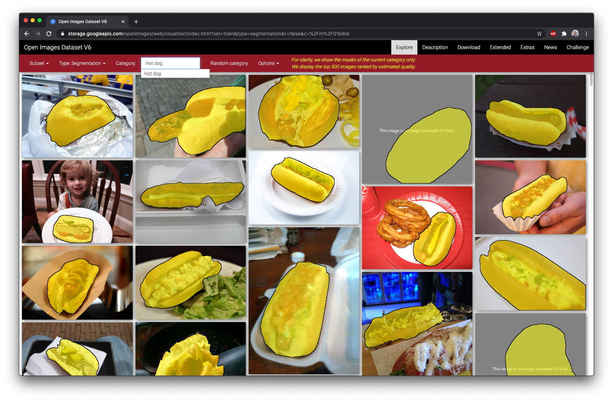
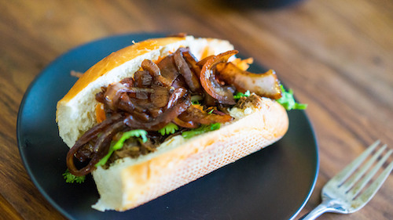
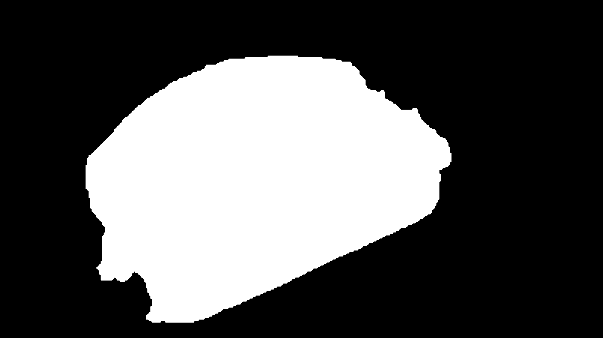
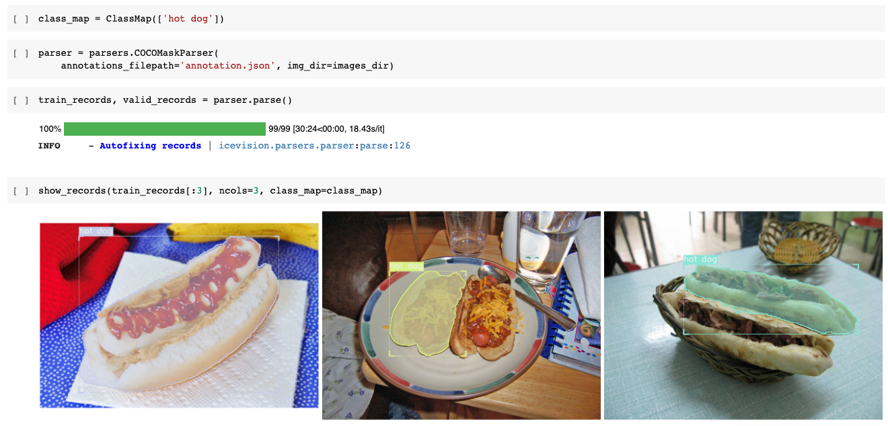
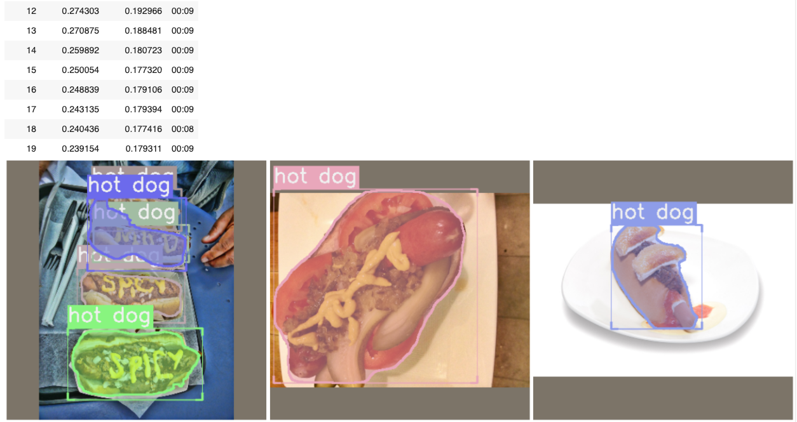

# Entrená un modelo custom de segmentación de imágenes

Repo que muestra paso a paso como entrenar un modelo que nos haga una prediccion de a que categoria pertenece cada pixel de una imagen. Hay varios frameworks que podemos usar para hacer esto, como [Detectron2](https://github.com/facebookresearch/detectron2) o [TF Object Detection API](https://github.com/tensorflow/models/blob/master/research/object_detection/g3doc/tf2_detection_zoo.md), pero hoy queria aprovechar para probar una libreria bastante nueva llamada [IceVision](https://github.com/airctic/icevision), que funciona encima de `PyTorch`.

En mi experiencia, a menos que podamos resolver nuestro caso de uso con un modelo `pre-trained`, tener que hacer algo custom se vuelve un trabajo bastante largo bastante rápido por tres cosas: hacer las anotaciones dibujando las masks, el tiempo que toma parsear la data en el formato adecuado para que podamos entrenar el modelo, y el tiempo que toma entrenar. Sobre el segundo punto, por ejemplo, una buena herramienta para anotar es [VGG Image Annotator](https://www.robots.ox.ac.uk/~vgg/software/via/via.html) pero el vocabulario que usa (la forma en que se guardan los datos en un `json`) se llama `PASCAL VOC` y normalmente vamos a tener que convertirla a `COCO` ([Common Objects in Context](https://cocodataset.org/)) antes de entrenar. Esto podemos solucionarlo con conversores (que hay varios) o con los parser que trae incluido `IceVision` pero aun nos quedan las otras dos cosas, especialmente la parte de anotar. Para resolver un poco esto agregue una parte donde vamos a bajar las anotaciones directamente de [OpenImages](https://storage.googleapis.com/openimages/web/index.html) para alguna de las 1,000 categorias que tienen disponibles.

## TL;DR

- Abri [este Notebook](https://colab.research.google.com/github/machinelearnear/custom-segmentation-model-with-icevision-openimages/blob/master/train_custom_segmentation_model_with_icevision_openimages.ipynb) en `Google Colab` y seguí los pasos para entrenar tu modelo, hacer una predicción sobre una imagen, y guardarlo a tu `Google Drive`.

## Antes de empezar

### Librerias

- https://github.com/airctic/icevision
- https://github.com/monocongo/openimages/tree/issue_7_segmentation_support
- http://imantics.readthedocs.io/

### Requisitos

- Tener una cuenta de Google para usar [Google Colab](https://colab.research.google.com/)

### Que es segmentacion de imágenes?
> Semantic segmentation, or image segmentation, is the task of clustering parts of an image together which belong to the same object class. It is a form of pixel-level prediction because each pixel in an image is classified according to a category.
>
> Some example benchmarks for this task are Cityscapes, PASCAL VOC and ADE20K. Models are usually evaluated with the Mean Intersection-Over-Union (Mean IoU) and Pixel Accuracy metrics.


( Image Credit: [ADE20K – MIT CSAIL Computer Vision Group](https://groups.csail.mit.edu/vision/datasets/ADE20K/) )

### Que es `OpenImages`?

Es un dataset ([link oficial](https://storage.googleapis.com/openimages/web/index.html)) de unas 9 millones de images con anotaciones que incluyen labels, bounding boxes, segmentation masks, relaciones visuales, etc. Sacado de la pagina oficial:

> Open Images is a dataset of ~9M images annotated with image-level labels, object bounding boxes, object segmentation masks, visual relationships, and localized narratives:
>
> It contains a total of 16M bounding boxes for 600 object classes on 1.9M images, making it the largest existing dataset with object location annotations. The boxes have been largely manually drawn by professional annotators to ensure accuracy and consistency. The images are very diverse and often contain complex scenes with several objects (8.3 per image on average). Open Images also offers visual relationship annotations, indicating pairs of objects in particular relations (e.g. "woman playing guitar", "beer on table"), object properties (e.g. "table is wooden"), and human actions (e.g. "woman is jumping"). In total it has 3.3M annotations from 1,466 distinct relationship triplets. In V5 we added segmentation masks for 2.8M object instances in 350 classes. Segmentation masks mark the outline of objects, which characterizes their spatial extent to a much higher level of detail. In V6 we added 675k localized narratives: multimodal descriptions of images consisting of synchronized voice, text, and mouse traces over the objects being described. (Note we originally launched localized narratives only on train in V6, but since July 2020 we also have validation and test covered.) Finally, the dataset is annotated with 59.9M image-level labels spanning 19,957 classes.

### Que es `IceVision`?

Es un framework que permite entrenar modelos de deteccion de objetos y segmentacion de imagenes de manera mucho mas facil y rapida. Esta hecho en Python y funciona encima de librerias como `Fastai`, `PyTorch Lighting`, y otras. Pueden leer mas en su repo oficial: https://github.com/airctic/icevision.

## Entrená tu modelo

### Levantar un environment

Como vamos a estar usando `Google Colab` para entrenar nuestro modelo no necesitamos instalar `Conda` o `pyenv-virtualenv`. Para quienes aun no lo conocen, `Google Colab` corre un environment de Machine Learning sobre un hardware (CPU, GPU, o TPU) que tendremos disponible por un periodo de tiempo limitado (hasta 12 horas). Aunque existen versiones de pago, en su version original es (aún) gratuito y nos permite entrenar algo relativamente complejo bastante facilmente.

Si, por otra parte, queres correr un environment en tu propia maquina o en Cloud, siempre podes levantar un Docker container con las ultimas librerias, e.g. [Jupyter Data Science Stacks](https://github.com/jupyter/docker-stacks), o tambien usar [Kaggle Kernels](https://www.kaggle.com/kernels) (similar a `Colab`), [Amazon SageMaker](https://aws.amazon.com/sagemaker/), etc.

### Generar un dataset para entrenar

Para poder generar un dataset desde las imágenes que ya estan anotadas en `OpenImages` vamos a usar una libreria llamada `openimages`. Si vamos al [repo](https://github.com/monocongo/openimages/tree/issue_7_segmentation_support) vamos a ver que hay un PR donde se agrega la posibilidad de bajar tambien las segmentation mask que es exactamente lo que necesitamos asi que vamos a clonar esa branch en particular en lugar de instalar usando `pip install openimages`. Para eso, corremos las siguientes lineas desde alguna celda de nuestro `Jupyter Notebook`

```sh
!git clone -b issue_7_segmentation_support https://github.com/monocongo/openimages.git oid
!pip install -r oid/requirements.txt
``` 

Siempre que usamos una `Notebook` (por ejemplo dentro de `Google Colab`) vamos a necesitar agregar `!` antes de algún `system command` que queremos ejecutar, e.g. `!git clone <repo>` o `!pip install <package>`. Esto es porque cuando agregas el `!` estas corriendo el comando en la terminal del environment o `kernel` que tenes activado. Tambien podes usar `%%sh` o `%%bash` arriba de todo en la celda y despues correr `git clone` o `pip install` sin el `!`. Una vez que la instalación terminó, vamos a reiniciar el kernel para que tome los cambios. No necesitamos hacer la instalacion de nuevo asi que podemos comentar esas lineas.

Vamos a agregar el directorio donde clonamos el repo a la lista de lugares que `Python` va a usar para importar librerias.

```python
import sys
sys.path.append('oid/src')
```

Y ahora si importamos `openimages`

```python
from openimages.download import download_segmentation_dataset
```

Para nuestro ejemplo, lo que queremos detectar es un choripan, uno de los grandes clásicos culinarios de Argentina. Como dato random, hace un par de años escribi un tutorial de como hacer un modelo de clasificacion de imágenes sobre lo mismo ([Train a Choripan Classifier with Fastai and Google Colab](https://medium.com/@nicolas.metallo/train-a-choripan-classifier-with-fast-ai-v1-in-google-colab-6e438817656a)) asi que es hora ya de actualizarlo.

Lo que vamos a hacer entonces es ir a la página de [OpenImages V6](https://storage.googleapis.com/openimages/web/index.html) y explorar si existe la categoria que estamos buscando. En menos de 5 segundos podemos ver que Google no se tomo en serio el trabajo de dibujar las segmentation masks a unos choris pero por suerte si lo hicieron para unos panchos o "Hot dogs" que vamos a usar para entrenar nuestro modelo.



Ahora que ya tenemos la categoria que vamos a usar nos tenemos que bajar el dataset con las imágenes, que aunque finalmente iran a la misma carpeta, inicialmente estan divididas en `train`, `valid`, y `test`. Es una buena idea agregar `meta_dir` porque es el path donde van a guardarse los csv (de varios GB) que se necesitan para bajar las imágenes y las masks.

```python
download_segmentation_dataset(dest_dir="anno", 
                              class_labels=["Hot dog",], 
                              annotation_format="pascal",
                              meta_dir="csv_anno")
```

Al final vamos a tener esta estructura de directorios

```sh
anno
├─ hot dog
│  ├─ images
│  ├─ pascal
│  └─ segmentations
```

Todas las imagenes van a ir sin ninguna modificacion en `images` y va a existir también un `xml` por imagen dentro de `pascal` donde van a estar las bounding boxes. Si lo que queremos hacer es un detector de objetos (e.g. YOLO, SSD, Faster-RCNN, etc.) con eso es suficiente. Dentro de `segmentations` vamos a encontrar unos `png` binarios (blanco y negro) por cada categoria/instancia de la mask.  

Este es un ejemplo de como se ven las anotaciones

Imagen original             |  Segmentation mask
:-------------------------:|:-------------------------:
  |  

### Convertir el formato del dataset de `PASCAL` a `COCO`

Como vamos a entrenar un modelo [Mask R-CNN](https://www.youtube.com/watch?v=xTByN4uVoCo) vamos a tener que convertir nuestro dataset a `COCO` y generar un `annotation.json`. Si queres aprender un poco mas sobre el formato de COCO y como hacerte tu propio dataset de cero podes leer [este articulo](https://www.immersivelimit.com/tutorials/create-coco-annotations-from-scratch/#coco-dataset-format).

Primero tenemos que importar las librerias que vamos a usar

```python
import imantics
from PIL import Image
from icevision.all import *
```

Y después hacer unas listas con todos los path a las las imagenes y segmentaciones que tenemos. 

```python
data_dir = Path('anno/hot dog')

images_dir = data_dir / 'images'
annotations_dir = data_dir / 'pascal'
segmentations_dir = data_dir / 'segmentations'

list_of_images = [x for x in images_dir.rglob('*.jpg')]
list_of_segmentations = [x for x in segmentations_dir.rglob('*.png')]
```

Es muy posible que tengamos mas de una segmentacion por imagen asi que vamos a generar un diccionario para que nos ayude a asignar esas segmentaciones a la misma imagen y que al final de todo nos genere el `json`. Sin darle mucha vuelta, me hice esta función que te genera directamente el `json` cuando le metes como input las listas que generamos antes.

```python
def create_coco_annotation_json(
    list_of_images: List[Path], 
    list_of_segmentations: List[Path],
    class_map: str = 'hot dog',
    path_to_output_json: str = 'annotation.json') -> Dict:
    """
    Source: www.machinelearne.ar
    Generates a COCO annotated json that maps images with segmentation masks
    :param images_dir: list of images 
    :param segmentations_dir: list of segmentations masks
    :param path_to_output_json: map images with segmentations into json
    """
    from datetime import date
    import json

    # create coco dict
    coco_segm_dict = defaultdict(list, { str(k):[] for k in list_of_images })
    for img in list_of_images:
      for mask in list_of_segmentations:
        if img.stem in str(mask): coco_segm_dict[str(img)].append(str(mask))

    # create base json
    coco = {
        "info": {
            "description": "Custom COCO Dataset",
            "url": "http://cocodataset.org",
            "version": "1.0",
            "year": 2020,
            "contributor": "www.machinelearne.ar",
            "date_created": date.today().strftime("%d/%m/%Y")},
        "images": [],
        "annotations": [],
        "categories": [],
        }

    # merge images with segmentations and create json
    annotations=[]
    images=[]
    segm_id = 0
    for id, (img,masks) in enumerate(list(coco_segm_dict.items())):
      image = imantics.Image.from_path(img)
      for x in masks:
        array = np.asarray(Image.open(x).resize(image.size))
        image.add(imantics.Mask(array), category=imantics.Category(class_map))
        image.id = id
        coco_json = image.export(style='coco')
        annotation = coco_json['annotations'][0]
        annotation['id'] = segm_id
        annotations.append(coco_json['annotations'][0])
        segm_id += 1
      images.append(coco_json['images'][0])
    # add to json and save to disk
    coco['categories'] = coco_json['categories']
    coco['annotations'] = annotations
    coco['images'] = images

    with open(path_to_output_json, 'w') as f:
        json.dump(coco, f)

    print(f"Done! File was saved to '{Path.cwd()}/{(path_to_output_json)}'")
    return coco
```

Y si lo corremos en la celda de nuestro Notebook vamos generar el `json`.

```python
coco_json = create_coco_annotation_json(list_of_images, list_of_segmentations)
$ Done! File was saved to '/content/annotation.json'
```

### Parsear la data y ver un preview

Primero definimos la variable `class_map` que es una clase que nos mapea las clases con unos IDs. Por defecto, el `ID=0` pertenece al background, asi que la clase que pongamos va a empezar de `1` en adelante. En este punto, tenemos que usar la misma clase que tienen nuestras anotaciones, es decir `hot dog`, aunque después mas adelante podamos cambiar la forma que nos referimos a esta clase como `choripan`.

```python
class_map = ClassMap(['hot dog'])
```

Ahora usamos la clase `parsers.COCOMaskParser` para cargar la data y la metemos en dos datasets, `train_records` y `valid_records`, con un random split.

```python
parser = parsers.COCOMaskParser(annotations_filepath='annotation.json', img_dir=images_dir)
train_records, valid_records = parser.parse()
```

Y podemos hacer un preview con lo siguiente:

```python
show_records(train_records[:3], ncols=3, class_map=class_map)
```



### Entrená tu modelo con `FastAI`

Una de las cosas buenas de [IceVision](https://airctic.com/) es que nos permite usar tanto [FastAI](https://www.fast.ai/) y [PyTorch Lighting](https://github.com/PyTorchLightning/pytorch-lightning) para orquestrar los loops de entrenamiento con un [buen ejemplo](https://airctic.com/quickstart/) acá de como funciona. Vamos a usar el siguiente código para transformar la data (tamaño de la imagen, random crops, rotación, etc.), meterla en un `DataLoader`, crear un modelo `Mask RCNN`, entrenarlo, y después hacer una inferencia sobre un set de validación.

```python
# Define the transforms and create the Datasets
presize = 512
size = 384
shift_scale_rotate = tfms.A.ShiftScaleRotate(rotate_limit=10)
crop_fn = partial(tfms.A.RandomSizedCrop, min_max_height=(size // 2, size), p=0.5)
train_tfms = tfms.A.Adapter(
    [
        *tfms.A.aug_tfms(
            size=size,
            presize=presize,
            shift_scale_rotate=shift_scale_rotate,
            crop_fn=crop_fn,
        ),
        tfms.A.Normalize(),
    ]
)
valid_tfms = tfms.A.Adapter([*tfms.A.resize_and_pad(size=size), tfms.A.Normalize()])
train_ds = Dataset(train_records, train_tfms)
valid_ds = Dataset(valid_records, valid_tfms)

# Shows how the transforms affects a single sample
samples = [train_ds[0] for _ in range(6)]
show_samples(
    samples, denormalize_fn=denormalize_imagenet, ncols=3, display_label=False, show=True
)

# Create DataLoaders
train_dl = mask_rcnn.train_dl(train_ds, batch_size=16, shuffle=True, num_workers=4)
valid_dl = mask_rcnn.valid_dl(valid_ds, batch_size=16, shuffle=False, num_workers=4)

# Define metrics for the model
# TODO: Currently broken for Mask RCNN
# metrics = [COCOMetric(COCOMetricType.mask)]

# Create model
model = mask_rcnn.model(num_classes=len(class_map))

# Create Fastai Learner and train the model
learn = mask_rcnn.fastai.learner(dls=[train_dl, valid_dl], model=model)
learn.fine_tune(20, 5e-4, freeze_epochs=2)

# BONUS: Use model for inference. In this case, let's take some images from valid_ds
# Take a look at `Dataset.from_images` if you want to predict from images in memory
samples = [valid_ds[i] for i in range(6)]
batch, samples = mask_rcnn.build_infer_batch(samples)
preds = mask_rcnn.predict(model=model, batch=batch)

imgs = [sample["img"] for sample in samples]
show_preds(samples=imgs, preds=preds, denormalize_fn=denormalize_imagenet, ncols=3, class_map=class_map)
```

Ya tenemos nuestro modelo listo! :ok_hand: 



### Hacer una predicción sobre una sola imagen

Primero definimoos una función que nos devuelva un array de la imagen

```python
import PIL, requests
def image_from_url(url):
    res = requests.get(url, stream=True)
    img = PIL.Image.open(res.raw)
    return np.array(img)
```

Después bajamos la imagen que queremos usar

```python
image_url = "https://s32020.pcdn.co/wp-content/uploads/2020/06/Choripan-e1593021143177.jpeg.optimal.jpeg"
img = image_from_url(image_url)
show_img(img);
```

Y cargamos la mismas transformaciones que usamos cuando entrenamos el modelo antes de hacer la predicción. Aca es donde podemos cambiar la clase que usamos de `hot dog` a `choripan`.

```python
infer_tfms = tfms.A.Adapter([*tfms.A.resize_and_pad(size=384), tfms.A.Normalize()])
infer_ds = Dataset.from_images([img], infer_tfms)

batch, samples = mask_rcnn.build_infer_batch(infer_ds)
preds = mask_rcnn.predict(model=model, batch=batch)

# Show preds by grabbing the images from `samples`
imgs = [sample["img"] for sample in samples]
show_preds(
    samples=imgs,
    preds=preds,
    class_map=class_map,
    denormalize_fn=denormalize_imagenet,
    show=True,
)
```

### Guardar modelo a tu `Google Drive` o bajar localmente

Una vez que terminamos de entrenar el modelo vamos a guardarlo en algún lado, a nuestro `Google Drive` si usamos `Colab` por ejemplo, o directamente a nuestro disco. Para esto vamos a exportar el modelo a un `.pth`, que es el formato que usa `PyTorch`.

```python
from google.colab import drive
drive.mount('/content/gdrive', force_remount=True)
root_dir = Path('/content/gdrive/MyDrive/')

fname = root_dir/'icevision/models/chori/chori_maskrcnn.pth'
fname.parent.mkdir(parents=True, exist_ok=True)

torch.save(model.state_dict(), fname)
```

En otro repo vamos a ver como usar este modelo en producción.

## Disclaimer

- El contenido mostrado en este repo no esta optimizado para ser usado en producción, asi que deberias usarlo bajo tu propia discreción.
- Las ideas y opiniones que salen en este repo representan las mias propias y no necesariamente las de mis empleadores.
